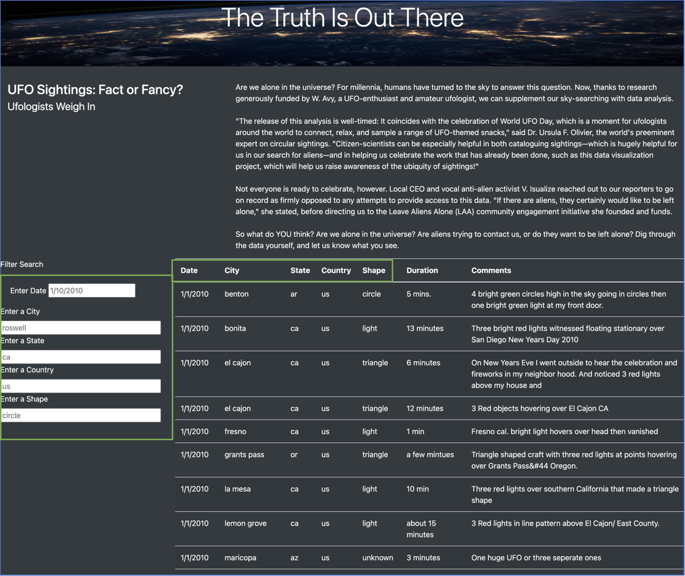
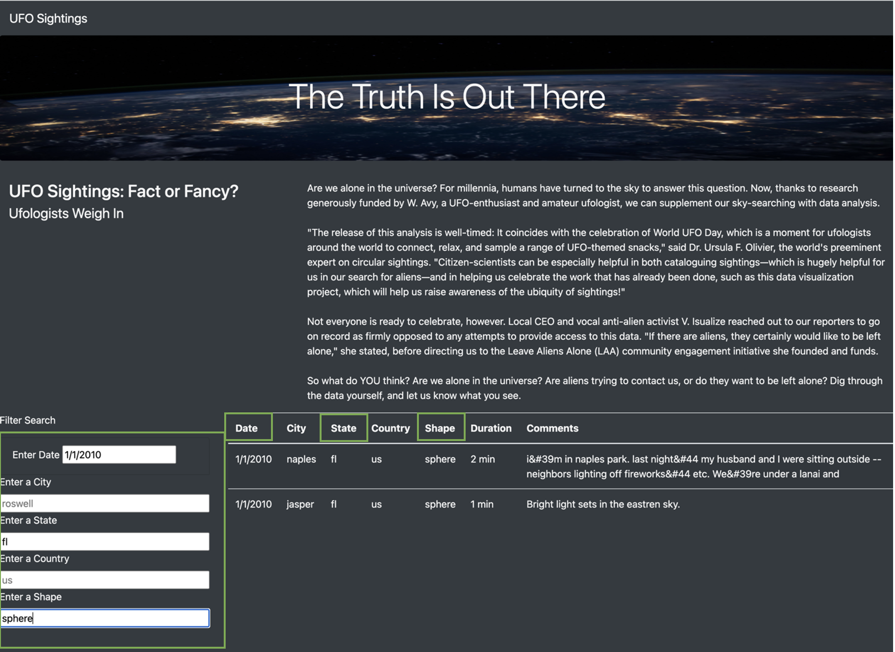

# UFO Sightings: Fact or Fancy?

## Overview of the Project
The purpose of this analysis is to create a webpage that presents a table of alien sightings from a data.js file. The dynamic webpage is built using JavaScript, D3 Javascript library, and HTML. The functionality allows users to filter the sightings by date, city, state, country, and shape. 

## Results 
The website is user-friendly and intuitive to use. Users enter their desired filter criteria into one or multiple of the input boxes. The filtered table is then displayed after the user hits `enter`. 

The user is presented with a webpage displaying the entire table and input boxes with placeholders showing examples of how to enter the filter criteria. 

The user will then type criteria that the table will then be filtered by once the user hits enter. The example below shows results for sphere-shaped UFO sightings on 1/1/2010 in Florida. There are two results that fit the criteria. 

Creating the table and filtering the data is achieved using three functions: `buildTable`, `updateFilters`, and `filterTable`. The first function, `buildTable` uses the `forEach` method twice. First to loop through each object in the `data.js` file and append a row and cell for each value in the row to the table body. The second `forEach` method uses the `Object.values` method to fill the table with one object from our array per row in our table. Each UFO siting in our `data.js` is one object. The second function `updateFilters` uses the `d3.select` function which tells the D3 JavaScript library to capture the user's input by using `property("value")` and the filter field using the `.attr("id")`. The final function `filterTable` uses the `Object.entries` and `forEach` method to loop through the filters and return an array of `[key, value]` containing our filter id and the user's input. It then filters our original table's data for the rows that whose values match the user's input and saves those rows in the `filteredData` variable. Lastly we use the `buildTable` function with the `filteredData` argument. We removed the filter button and instead a change to the input as our D3 listening event which allows the filter functions to execute once the user hits Enter. 

## Summary
Although the webpage is easy to use and provides the users with the ability to filter through hundreds of rows of data with a few simple keystrokes, there is always room to improve the user's experience. Currently, the filters are case and format-sensitive which means a user can filter for "benton" but not "Benton". Similarly, you can filter for "1/10/2010" but you cannot filter for UFO sightings that occurred in month of January (any year). 
To improve the user experience, we should look into expanding criteria for filter input. For example, we can chain the `.toLowerCase()` method to the `changedElement.propery("value")` line of code. Since our table is in all lower case, this will convert the user's input to lower case so that the `row[key]` will still match the `value` in the `filterTable` function and the filter will apply regardless of whether the user uses lower case, upper case, or a combination. The second improvement could be on the comments columns. Some of the entries have HTML character codes (ex. &#44 show instead of commas). Two possible solutions would be to either clean up the data in the `data.js` file or we can change the encoder in our `index.html` file. 